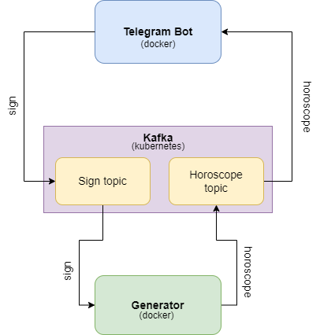

# horoscope
## Цель
Создать телеграм-бота, с помощью которого пользователь сможет сгенерировать гороскоп для интересующего знака зодиака.
## Задачи 
1) выбрать набор данных и модель
2) получение датасета
3) обработка данных
4) дообучение модели
5) сохранение модели
6) реализация телеграм-бота:
   - описание архитектуры
   - реализация генератора гороскопов
   - реализация самого бота
   - реализация классов `kafkaConsumer`, `kafkaProducer`
   - подготовка конфигурации для деплоя `Kafka` на k8s кластер
   - сборка docker-образа генератора и телеграм-бота

## Описание
Проект включает себя две составляющие: реализиация дообучения модели и реализация телеграм-бота с его инфраструктурой.

### horo_train_model_colab.ipynb
Данный файл содержит реализацию дообучения модели gpt3-small от Сбербанка на датасете, состоящим из гороскопов. Обучение производилось в google colab с импользованием графического ускорителя.

### bot/generate.py
В данной программе реализована функция `generate_horoscope(sign: str, tok, model)`, которая принимает sign - знак зодиака, tok - токенизатор, model - предзагруженную модель и генирирует гороскоп.
В main loop'e данная программа ожидает сообщения из топика `Kafka`. Если она получает сообщение, то она запускает генерацию гороскопа. После, отправляет сгенерированный гороскоп в другой топик, из которого читает сам телеграм бот.

### bot/config.py
Данный файл содержит конфиг бота.

### bot/bot.py
Данный файл содержит реализацию бота с двумя хэндлерами: `/start` и `/generate <sign>`. При `/start` бот отправляет приветственное сообщение, при `/generate <sign>` бот отправляет в топик для генерации знак зодиака, после ожидает из другого топика появление гороскопа и выводи его пользователю.

## Использование
1) Необходимо скачать полученную обученную модель или предобучить модель. Для этого нужно поэтапно запустить все ячейки в `horo_train_model_colab.ipynb`. В результате в корневой папке создаться папка `models`, в которой находится обученная модель.
2) Заполнить конфинг в `bot/config.py` токеном бота.
3) Задеплоить `Kafka` на k8s кластер. Рекомендованный порядок применения манифестов (перед деплоем `kafka-broker` необходимо в `kafka-broker.yaml` заменить IP в `spec.template.spec.containers.env[1].value` на CLUSTER IP пода `zookeeper`):
```
kubectl apply -f kube/kafka-namespace.yaml
kubectl apply -f kube/zookeeper.yaml
kubectl apply -f kube/kafka-broker.yaml
```
4) Собрать docker-образ из `Dockerfile` или скачать готовый образ `yarikkkkkk/bot_images` с hub.docker.com
5) Запустить порт-форвард пода `kafka-broker`:
```
kubectl port-forward <kafka-broker> 9092 -n kafka
```
6) Запустить docker-контейнер:
```
docker run --network="host" bot_images
```
Бот будет доступен по никнейму, который соответствует токену.

## Архитектура

### Посредник



Вид архитектуры - посредник. В роли самого посредника выступает Kafka, а индивидуальные компоненты в этой архитектуре - Телеграм Бот и Генератор.
